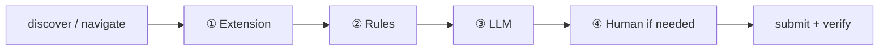

# WboxCLI

Production-grade CLI for automated job applications across multiple ATS platforms, powered by a self-learning local intelligence engine.

> **Naming:** Python package is `jobcli`; the installed command is **`wboxcli`**. Dev runs use `PYTHONPATH=src` and `python -m jobcli.cli.main` (or `python -m jobcli.cli.entry` for the TUI).

> **Windows & macOS command guide (extension ZIP, unzip, onboarding, `apply`):**  
> See **[docs/SETUP_WINDOWS_MAC.md](docs/SETUP_WINDOWS_MAC.md)** — full copy-paste commands for CMD, PowerShell, and bash.

---

## Features

### Core Automation
- **No `.env` files** — credentials, LLM keys, resume paths, and the API base URL all live in `~/.jobcli/jobcli.db`, written by `wboxcli login`, `wboxcli resume-upload`, and `wboxcli config`. The CLI never reads a `.env` file.
- **Guided interactive TUI** — `wboxcli` onboarding: WBL login (visible Chrome + extension check) → LLM key → resume paths → **profile summary + Confirm (Y/N)** → auto `discover`. Each step shows a `▶ Next step` panel; `apply` is manual when you are ready.
- **TalentScreen extension** — copy any built `*.zip` into `extension/` (e.g. `talentscreen-autofill-v2.0.0.zip`); the CLI picks the newest match and unpacks to `~/.jobcli/extension_unpacked/` for `apply`.
- **Always-visible browser** — `wboxcli apply` forces `headless=False`; Chrome is always on screen so you can watch and intervene.
- **Fill order** — Chrome **extension autofill** first, then **rules-based** ATS handlers, then **LLM** for remaining fields. Don't-refill guards prevent later passes from overwriting populated fields.
- **Required-first human prompt** — when fields stay empty after extension + rules + LLM, the terminal asks for `[red]*required[/red]` fields first (must answer) and `[dim](optional, Enter to skip)[/dim]` fields second (press Enter to skip). The `required` flag is propagated from the page's Accessibility Tree.
- **Source-filtered discover** — `wboxcli discover` only ingests links whose WBL `Source` value is one of `trueup.io`, `hiring.cafe`, `jobright`, `linkedin`. Other listings (Indeed, Workday, …) are dropped at ingest time and never touch the local DB, so `apply` simply iterates whatever is in the queue. To change the allow-list, edit `DEFAULT_SOURCES` in [`src/jobcli/orchestration/source_filter.py`](src/jobcli/orchestration/source_filter.py).
- **WBL job listings API** — `wboxcli discover` calls `GET {sync_server_url}/positions/cli_window` (default base `https://api.whitebox-learning.com/api`, Bearer auth), pages until every row is fetched (default: all time, `open` only). Tune with `JOBCLI_DISCOVER_DAYS`, `JOBCLI_DISCOVER_PAGE_SIZE`, `JOBCLI_DISCOVER_STATUS`. Legacy Playwright scrape: `WBOX_DISCOVER_MODE=browser` or `wboxcli discover --legacy-ui`.
- **Advanced AI Reasoning** — AXTree (Accessibility Tree) analysis for high-accuracy form field mapping
- **Universal Iframe Support** — Reach-through for Greenhouse, Lever, Paylocity, and nested iframes
- **JS Force-Fill Fallback** — Bypasses stubborn React/Angular event listeners for 100% input reliability
- **Four-step fill pipeline** — Extension → Rules → LLM → Human (only when needed). See [Apply fill pipeline](#apply-fill-pipeline).
- **Interactive Terminal Help** — If the agent fails to find a field, it pauses and asks you in the terminal. You can pick options (Yes/No) or enter values directly without switching to the browser.
- **Robust Manual Skip** — Typer-friendly skip command handles common typos (`skipp`, `skp`, `s`) during high-speed application loops.
- **Resume Path Validation** — Automatically detects missing resume files and warns you instead of crashing, ensuring batch continuity.
- **Multi-Provider LLM** — Native support for OpenAI, Anthropic, and Google Gemini
- **LinkedIn handling** — LinkedIn URLs prompt to skip (default: yes). If you continue, the CLI hands off the browser until you press ENTER (600s wait in supervised/manual; 60s in `auto`, then the job is skipped).
- **Job Activity Dashboard Sync** — After `wboxcli apply` (auto-sync at end of batch) or `wboxcli sync`, pushes recent `SUBMITTED` and `FAILED` jobs (title, company, status, timestamp) to the central dashboard

### Phase 1 — Local Learning & Memory Engine
- **Confidence-Based Memory** — Answers are only trusted after ≥ 3 successful uses at ≥ 60% confidence
- **Merge Protection** — Human/user answers can never be silently overwritten by auto-learned data
- **Outcome Feedback Loop** — Every Playwright action (success or failure) updates confidence scores in real-time
- **Personal Data Isolation** — PII fields (email, phone, name, address, etc.) are never stored in reusable memory
- **Structured Logging** — JSON logs with screenshots and DOM snapshots

### Phase 2 — Knowledge & Activity Sync *(updated)*
- **Anonymous Crowd Intelligence** — Share only high-confidence, non-PII patterns with the central server
- **Aggregated Downloads** — Pull the best field answers and UI locators from all contributing users
- **Automated Activity Logging** — Pushes your application history (title, company, status) to the central dashboard
- **Intelligent Job Mapping** — Automatically maps local job titles to centralized job types for accurate metrics
- **Unified Sync Flow** — Single command to keep your local engine and central dashboard in perfect sync

---

## Installation

### One-Line Install (Recommended)

Requires **Python 3.10+** and **git**.

### Stable Release (Main)

**macOS / Linux:**
```bash
curl -fsSL https://raw.githubusercontent.com/WhiteboxHub/wbox-cli/main/scripts/install.sh | bash
```

**Windows (PowerShell):**
```powershell
irm https://raw.githubusercontent.com/WhiteboxHub/wbox-cli/main/scripts/install.ps1 | iex
```

### Development Release (Dev)

*For testing the latest features.*

**macOS / Linux:**
```bash
JOBCLI_BRANCH=dev curl -fsSL https://raw.githubusercontent.com/WhiteboxHub/wbox-cli/dev/scripts/install.sh | bash
```

**Windows (PowerShell):**
```powershell
$env:JOBCLI_BRANCH="dev"; irm https://raw.githubusercontent.com/WhiteboxHub/wbox-cli/dev/scripts/install.ps1 | iex
```

This installs `wboxcli` globally — available from any terminal, just like `nvm` or `curl`. No virtual environment activation needed. After install, the interactive TUI launches automatically.

**Two ways to use it:**

| Command | What it does |
|---|---|
| `wboxcli` | Opens the interactive TUI |
| `wboxcli setup` | CLI 5-step setup: config check → resume → **discover** → extension unpack + browser test (not the same as TUI `setup`; see below) |
| `wboxcli apply` | Direct CLI — apply to all pending jobs after `discover` |

**What the installer does:**
1. Clones the repo to `~/.jobcli/src`
2. Creates an isolated Python venv at `~/.jobcli/venv`
3. Installs all dependencies + Playwright Chromium
4. Drops `wboxcli` at `~/.local/bin/` (Windows: `wboxcli.cmd`)
5. Clones the TalentScreen extension repo into `~/.jobcli/src/bin/project-talentscreen-autofill-extension`
6. Adds `~/.local/bin` to your PATH (if not already there)
7. Auto-launches the interactive TUI

> **Re-running the one-line installer** deletes `~/.jobcli/jobcli.db*` if `~/.jobcli/` already exists (fresh DB). Use `wboxcli uninstall` to remove the whole install tree without reinstalling.

**To update** (you can also use the local `./scripts/wboxcli.sh update` command):

```bash
# macOS / Linux (Main)
curl -fsSL https://raw.githubusercontent.com/WhiteboxHub/wbox-cli/main/scripts/install.sh | bash

# macOS / Linux (Dev)
JOBCLI_BRANCH=dev curl -fsSL https://raw.githubusercontent.com/WhiteboxHub/wbox-cli/dev/scripts/install.sh | bash
```
```powershell
# Windows PowerShell (Main)
irm https://raw.githubusercontent.com/WhiteboxHub/wbox-cli/main/scripts/install.ps1 | iex

# Windows PowerShell (Dev)
$env:JOBCLI_BRANCH="dev"; irm https://raw.githubusercontent.com/WhiteboxHub/wbox-cli/dev/scripts/install.ps1 | iex
```

**To uninstall** (you can also use the local `./scripts/wboxcli.sh uninstall` command):

```bash
# macOS / Linux (Main)
bash -c "$(curl -fsSL https://raw.githubusercontent.com/WhiteboxHub/wbox-cli/main/scripts/uninstall.sh)"

# macOS / Linux (Dev)
bash -c "$(curl -fsSL https://raw.githubusercontent.com/WhiteboxHub/wbox-cli/dev/scripts/uninstall.sh)"
```
```powershell
# Windows PowerShell (Main)
irm https://raw.githubusercontent.com/WhiteboxHub/wbox-cli/main/scripts/uninstall.ps1 | iex

# Windows PowerShell (Dev)
irm https://raw.githubusercontent.com/WhiteboxHub/wbox-cli/dev/scripts/uninstall.ps1 | iex
```

### Manual Install (For Development)

**Full step-by-step (extension build → ZIP → unzip → commands):** [docs/SETUP_WINDOWS_MAC.md](docs/SETUP_WINDOWS_MAC.md)

| OS | First-time dev setup | Daily run |
|----|----------------------|-----------|
| **macOS / Linux** | `./build.sh` then `source .venv/bin/activate` | `export PYTHONPATH=src` → `python -m jobcli.cli.main apply --limit 1` or `wboxcli` |
| **Windows (CMD)** | `build.bat` | `set PYTHONPATH=src` → `.\.venv\Scripts\python.exe -m jobcli.cli.main apply --limit 1` |
| **Windows (PowerShell)** | `.\build.bat` | `$env:PYTHONPATH="src"` → `.\.venv\Scripts\python.exe -m jobcli.cli.main apply --limit 1` |

`build.sh` / `build.bat` create `.venv`, install Playwright, and unpack the newest `extension/*.zip` into `~/.jobcli/extension_unpacked/` (Chrome loads the **folder**, not the ZIP). Force refresh: `FORCE_REINSTALL_EXTENSION=1`.

> **Windows:** Use `set PYTHONPATH=src` in **CMD**, not `$env:PYTHONPATH` (PowerShell only).  
> **Windows extension build:** use `build.ps1` in the extension repo if Git Bash lacks `zip`.

---

## Quick Start — Interactive TUI (recommended for first-time users)

**First-time users** need an empty or reset DB — credentials and resume are saved to `~/.jobcli/jobcli.db` and are **not** asked again on later `apply` runs. See [Starting fresh](#starting-fresh-re-trigger-onboarding) below.

| OS | Launch TUI |
|----|------------|
| Global install | `wboxcli` |
| Windows dev | `build.bat` |
| macOS / Linux dev | `./build.sh` then `wboxcli` or `python src/jobcli/cli/entry.py` with `PYTHONPATH=src` |

Just run (global install):

```powershell
wboxcli
```

If `~/.jobcli/` is new (or you cleared settings), onboarding runs in this order:

| # | Step | What happens |
|---|---|---|
| 1 | **WBL login + browser test** | Email/password → visible Chrome → progress lines (`… Launching Chrome`, `… Loading extension`, etc.) → `✓ Open browser`, `✓ Plugin load`, `✓ Test successful`. Saved to `~/.jobcli/jobcli.db`. |
| 2 | **LLM + API key** | Pick OpenAI / Anthropic / Gemini; key validated in-process. |
| 3 | **Resume** | PDF + JSON paths → validate → **Profile Summary** → `Confirm? (Y/N)`. On **Y**: save resume, run **`discover`** (not `apply`). |
| — | **After setup** | Type `apply` when you want to start applying. |

A `▶ Next step` panel after each phase shows the next command.

Returning users (where `~/.jobcli/jobcli.db` already exists) skip straight to the welcome banner and the `▶ Next step: apply` panel.

### TUI vs CLI `setup` (important)

| How you run it | What happens |
|----------------|--------------|
| `wboxcli` → type **`login`** | Interactive onboarding (WBL + extension test → LLM → resume + confirm → `discover`) |
| `wboxcli` → type **`setup`** | Same as **`login`** — re-runs interactive onboarding (`_run_onboarding`) |
| **`wboxcli setup`** (subcommand) | CLI 5-step setup: verify config → resume → **`discover`** → unpack extension + browser test |
| `./scripts/wboxcli.sh setup` | Runs **`wboxcli setup`** (CLI 5-step), not TUI onboarding |

### Starting fresh (change login, keys, or resume)

`quit` does not clear saved state. To re-enter credentials, API keys, or resume:

| Goal | Command |
|------|---------|
| Clear login, LLM keys, resume (keep jobs) | `wboxcli reset` then `wboxcli` or `wboxcli setup` |
| Wipe **everything** (jobs, memory, credentials) | `wboxcli db reset` |

```bash
wboxcli reset          # confirm prompt
wboxcli reset --force  # no prompt
```

Re-running the **one-line installer** resets `jobcli.db` (see Installation). **`wboxcli uninstall`** removes all of `~/.jobcli/`. Updating code via `./scripts/wboxcli.sh update` does not wipe the DB.

---

## Quick Start — Direct CLI subcommands

WboxCLI is fully **interactive** — there is no `.env` file. All configuration is stored in
`~/.jobcli/jobcli.db` by the commands below. The same four steps work on PowerShell, zsh, and bash.

### Step 1 — Save credentials and LLM keys

```bash
wboxcli login
```

You'll be prompted for:
- Whitebox Learning username/password
- LLM API keys (at least one of OpenAI, Anthropic, Gemini)
- Default LLM provider (`openai` / `anthropic` / `gemini`)

You are **never asked for the WBL API base URL**. The CLI silently probes the hardcoded production endpoint — `https://api.whitebox-learning.com/api` — with the credentials you just entered, and saves it if authentication succeeds. If it's unreachable at login time, the next `wboxcli discover` re-probes automatically. Developers running a local backend can override the saved URL with `wboxcli config --key sync_server_url --set <url>`.

Re-running `wboxcli login` updates the saved values. `wboxcli login --auto` skips prompts only if **both** WBL credentials **and** at least one LLM API key are already saved.

### Step 2 — Load your resume

```bash
# Windows (PowerShell)
wboxcli resume-upload --pdf "C:\Users\you\resume.pdf"
# optional: --json "C:\Users\you\resume.json"

# macOS / Linux
wboxcli resume-upload --pdf "/Users/you/resume.pdf"
```

`--json` is optional: defaults to `<pdf>.json` beside the PDF, or generates a minimal profile from your WBL login email if no JSON exists. Paths are saved to `~/.jobcli/jobcli.db`. The PDF is attached at apply time; JSON drives form fields.

### Step 3 — CLI setup (config, discover, extension, browser test)

```bash
wboxcli setup
```

Runs **5 steps**: (1) verify config in DB, (2) reload resume from saved paths, (3) **`discover`** if WBL credentials exist, (4) unpack `extension/*.zip` + visible browser smoke test, (5) summary. Requires `login` first. Build/copy the ZIP first — see [Local extension dev loop](#local-extension-dev-loop).

> First-time users can skip this if they completed interactive onboarding (`wboxcli` → login flow), which already runs `discover` after resume confirm.

### Step 4 — Discover, then apply

```bash
wboxcli discover
wboxcli apply
```

Apply to a single URL (optional):

```bash
wboxcli apply --url "https://boards.greenhouse.io/company/jobs/123"
```

`wboxcli apply` with no arguments applies to **all pending jobs** in your local DB. Chrome always opens visibly — `apply` is a human-in-the-loop flow by design.

## WboxCLI Management Script (`wboxcli.sh`)

A comprehensive local management script is provided at `scripts/wboxcli.sh` to handle installation, updates, database operations, and setups cleanly.

### Usage
```bash
./scripts/wboxcli.sh <command> [options]
```

### Commands Reference

| Command | Action |
|---|---|
| `./scripts/wboxcli.sh install` | Clones the repo, sets up Python venv, installs dependencies and Playwright Chromium, drops the wrapper at `~/.local/bin/wboxcli`. |
| `./scripts/wboxcli.sh setup` | Runs **`wboxcli setup`** (CLI 5-step; not TUI onboarding). |
| `wboxcli reset` | Clear login, API keys, resume; **jobs kept**; re-onboard. |
| `wboxcli db reset` | Delete entire `jobcli.db`. |
| `./scripts/wboxcli.sh update` | Pulls the latest code from the branch and reinstalls the application and its dependencies. |
| `./scripts/wboxcli.sh uninstall` | Completely removes WboxCLI, deleting the `~/.jobcli` install directory and the global wrapper shims. |
| `./scripts/wboxcli.sh clear-jobs` | Deletes discovered jobs and per-job application logs only (retains credentials, LLM keys, resume, and learned memory). |
| `./scripts/wboxcli.sh doctor` | Runs local environment health checks. |
| `./scripts/wboxcli.sh status` | Displays a detailed installation status. |

---

## Cleanup, DB Reset, and Uninstall

> **`quit` does not wipe state.** Use `wboxcli reset` to clear login/keys/resume (jobs kept). Use `wboxcli db reset` for a full DB wipe. See [Cleanup](#cleanup-db-reset-and-uninstall) below.

WboxCLI gives you **four levels of cleanup**, smallest to largest:

| Command | Removes | Keeps |
|---|---|---|
| `wboxcli db clear-jobs` | Discovered jobs + per-job logs | Credentials, resume, LLM keys, field memory |
| **`wboxcli reset`** | Login, LLM keys, resume paths, stored resume JSON, **`sync_server_url`**, **`extension_path`** | **Jobs**, field memory, `~/.jobcli/logs/` on disk, unpacked extension **folder** may remain |
| `wboxcli db reset` | All SQLite data (jobs, memory, config in DB) | `~/.jobcli/logs/` files on disk, `extension_unpacked/`, venv, shims |
| `wboxcli uninstall` | All of `~/.jobcli/` + global shims | PATH entry (remove manually if needed) |

### 1. Just forget the discovered jobs

```bash
./scripts/wboxcli.sh clear-jobs          # confirms first
./scripts/wboxcli.sh clear-jobs --force  # skip the prompt
```

Resets the `jobs` and `application_logs` tables only.

### 2. Reset login, API keys, and resume (jobs kept)

```bash
wboxcli reset
```

Clears Whitebox email/password, LLM API keys, resume, saved API URL, and extension path in DB. Run `wboxcli` (TUI `login`) to re-onboard, or `wboxcli login` + `resume-upload`. Optional: `--keep-credentials`, `--keep-extension`, `--force`.

### 3. Wipe the entire local database

```bash
wboxcli db reset --force
```

Deletes `~/.jobcli/jobcli.db` (+ WAL/SHM/journal) and recreates empty tables. Does **not** delete `~/.jobcli/logs/` files on disk, `extension_unpacked/`, venv, or shims.

### 4. Full uninstall (Windows + macOS + Linux)

```bash
./scripts/wboxcli.sh uninstall           # confirms first
```

What it does:
- Releases all SQLite/log file handles so Windows doesn't block deletion.
- Deletes everything under `~/.jobcli/` (config, DB, extension, logs).
- Deletes the global shims: `wboxcli.cmd` on Windows, `wboxcli` / `wboxcli` elsewhere.
- **On Windows, if `wboxcli` is the running process**, the venv subtree under `~/.jobcli/venv/` is *intentionally* skipped (Python can't delete its own executable). The command prints a one-liner to finish the job from a fresh terminal — usually the bundled `scripts/uninstall.ps1` one-liner from the [Installation](#installation) section.

If `wboxcli uninstall` ever leaves files behind, the **bundled shell uninstaller** is the always-clean fallback because it doesn't run from inside the venv:

```bash
# macOS / Linux (Main)
bash -c "$(curl -fsSL https://raw.githubusercontent.com/WhiteboxHub/wbox-cli/main/scripts/uninstall.sh)"

# macOS / Linux (Dev)
bash -c "$(curl -fsSL https://raw.githubusercontent.com/WhiteboxHub/wbox-cli/dev/scripts/uninstall.sh)"
```
```powershell
# Windows PowerShell (Main)
irm https://raw.githubusercontent.com/WhiteboxHub/wbox-cli/main/scripts/uninstall.ps1 | iex

# Windows PowerShell (Dev)
irm https://raw.githubusercontent.com/WhiteboxHub/wbox-cli/dev/scripts/uninstall.ps1 | iex
```

> The PATH entry pointing to `~/.local/bin` is left alone by every cleanup command — remove it from your shell profile (`~/.zshrc` / `~/.bashrc`) or Windows System Environment Variables if you want it gone too.

---

## Interaction Modes

Control how much the agent pauses for your input:

```bash
# supervised (default) — AI drives; terminal prompts for missing fields; timed pauses on some steps
wboxcli apply --mode supervised
# single URL
wboxcli apply --url <url> --mode supervised
# auto — no terminal field prompts; browser handoff on CAPTCHA / auth / unfilled required fields (60s handoff timeout)
wboxcli apply --mode auto
# manual — confirm each planned LLM action batch before execution
wboxcli apply --mode manual
```

### Two-tier human prompt (Supervised / Manual)

When the extension + rules + LLM still leave fields empty, the terminal pauses with a yellow panel summarising the gap, then asks for the missing fields in two passes:

1. **Required fields** — labelled `[red]*required[/red]`. Enter a non-empty value; **empty Enter skips** that field (may trigger browser handoff later).
2. **Optional fields** — labelled `[dim](optional, Enter to skip)[/dim]`. Press Enter to skip; any text you type is filled.

The `required` flag is read directly from the page's Accessibility Tree (`aria-required`, the HTML `required` attribute, or a visible `*` next to the label), so it matches what the form itself considers mandatory.

In **`--mode auto`**, the terminal required/optional passes are **skipped**; unresolved fields route to **browser handoff** (`handoff_to_human`, 60s timeout in auto, then job skipped).

### Filtering by Source

Every job listing carries a `Source` value in the WBL dashboard (visible as the **Source** column — values like `Linkedin`, `Jobright`, `Hiring.Cafe`, `Trueup.Io`, `Indeed`, …). The filter is **unconditional and applied at discover time**: `wboxcli discover` only ingests rows whose `Source` matches the allow-list — every other row is dropped before it touches the local SQLite database.

The default allow-list is the four CLI-friendly sources:

- `trueup.io`
- `hiring.cafe`
- `jobright`
- `linkedin`

```bash
# Pull only allow-listed listings into the local queue.
# No flag, no env var — the filter is always on.
wboxcli discover

# Apply iterates whatever discover persisted; no source filter needed here.
wboxcli apply
```

> **Each `discover` replaces the local job queue** — it clears existing jobs/logs in SQLite, then re-imports from WBL (not an incremental merge).

Notes:
- Comparison is **case- and punctuation-insensitive**: `LinkedIn`, `linkedin`, `LINKEDIN` and `Linked-In` all normalise to the same token.
- Rows with a missing/empty `source` value are rejected too, so legacy listings predating the column can't sneak through.
- To change the allow-list, edit the `DEFAULT_SOURCES` tuple in [`src/jobcli/orchestration/source_filter.py`](src/jobcli/orchestration/source_filter.py). There is intentionally **no** `--sources` flag or env var — the only change path is the source tuple.
- **Upgrading?** If you ran `wboxcli discover` on a build that pre-dates this filter, your local DB may still contain rows from disallowed sources. Run `wboxcli db clear-jobs --force` or `wboxcli db reset --force`, then `wboxcli discover`.

---

## LinkedIn Jobs

LinkedIn does not allow reliable bot automation. When `apply` hits a `linkedin.com` URL:

1. The browser opens the job page.
2. The CLI asks: **“This is a LinkedIn job. Should I skip it?”** (default: **Yes** → job marked `SKIPPED`, next job).
3. If you answer **No**, the CLI **hands off the browser** — apply manually, then press **ENTER** in the terminal when done.
4. Handoff timeout: **600s** in supervised/manual; **60s** in `auto` (then the job is skipped). There is **no** terminal countdown timer.

Job-board landing pages (LinkedIn, Indeed, etc.) may also trigger an earlier handoff before the ATS form opens.

---

## Commands Reference

### Setup & daily flow

| Command | Description |
|---|---|
| `wboxcli login` | **Required first** — save Whitebox credentials, API base URL, and LLM keys to local config |
| `wboxcli login --auto` | Skip prompts if credentials are already saved in local config |
| `wboxcli resume-upload --pdf <file.pdf> --json <file.json>` | Load resume into local config |
| `wboxcli setup` | CLI 5-step: config → resume → **discover** → extension unpack + browser test |
| `wboxcli discover` | Replace local jobs from WBL API (`GET …/positions/cli_window`, paginated). `--headless` only affects `--legacy-ui` |
| `wboxcli discover --legacy-ui` | Playwright dashboard scrape instead of API (`WBOX_DISCOVER_MODE=browser`) |
| `wboxcli apply` | Apply to all **pending** jobs (typical flow after `discover`) — Chrome opens visibly |
| `wboxcli apply --url <url>` | Apply to a single specific job URL |
| `wboxcli apply --mode auto / supervised / manual` | Set interaction level (see [Interaction Modes](#interaction-modes)) |
| `wboxcli questions` | Pre-fill answers to common application questions |
| `wboxcli open-dashboard` | Launch an interactive browser window logged into Wbox |
| `wboxcli scan` | Scan configured ATS portals for open jobs |
| `wboxcli sync` | Push learned patterns / activity to the server and pull global updates |
| `wboxcli agent <prompt>` | Autonomous coding agent (dev/experimental; requires LLM key) |

### Interactive TUI-only (type at `wboxcli` prompt)

| Command | Maps to |
|---------|---------|
| `jobs`, `status`, `help`, `clear`, `update` | Built-in TUI actions |
| `login`, `setup` | Interactive onboarding (not CLI `wboxcli setup`) |
| `resume` | `resume-upload` |
| `dashboard` | `open-dashboard` |
| `config` | `wboxcli config` |

### Config inspection

| Command | Description |
|---|---|
| `wboxcli config` | Show the full saved config table |
| `wboxcli config --key <name>` | Show a single saved value |
| `wboxcli config --key <name> --set <value>` | Update a single value (e.g. `sync_server_url`) |

### Cleanup commands (see [Cleanup, DB Reset, and Uninstall](#cleanup-db-reset-and-uninstall))

| Command | Scope |
|---|---|
| `wboxcli db clear-jobs [--force]` | Jobs + per-job logs only |
| **`wboxcli reset`** `[--force]` `[--keep-credentials]` `[--keep-extension]` | Login, API keys, resume — **jobs kept** |
| `wboxcli db reset [--force]` | Entire SQLite DB |
| `wboxcli uninstall [--force]` | All of `~/.jobcli/` + shims |

### Diagnostics & extras

| Command | Description |
|---|---|
| `wboxcli doctor` | Validate Playwright, SQLite, config, and resume JSON |
| `wboxcli server` | Start FastAPI control center (`jobcli.api.main`, default port **8000**; optional `ui/` on port **3000**) |

---

## Architecture

Source lives under `src/jobcli/` (installed as the `jobcli` package):

```
src/jobcli/
├── cli/                    # main.py (Typer), interactive.py (TUI), doctor.py
├── orchestration/          # Application engine & discovery
│   ├── engine.py           # Apply loop: extension → rules → LLM → human
│   ├── tool_executor.py    # Playwright actions + don't-refill guard
│   ├── wbox_discoverer.py  # WBL API discover (default)
│   └── source_filter.py    # Discover allow-list (trueup, hiring.cafe, …)
├── ats/
│   ├── handlers/           # 20 dedicated ATS handlers + GenericATSHandler fallback
│   ├── locators/           # Form fillers, apply buttons, overlays
│   └── detector/           # ATS platform detection
├── llm/                    # AX tree + multi-provider client
├── utils/
│   ├── extension_helpers.py  # ZIP pick/unpack, Chrome + MV3 worker test
│   ├── fill_guard.py           # Skip refill on already-populated fields
│   └── resume_helpers.py       # Resume paths, profile summary, confirm
├── storage/                # SQLite models + repositories (~/.jobcli/jobcli.db)
├── sync/                   # Crowd knowledge upload/download
├── memory/                 # Application memory store
├── intelligence/           # Synonym resolver, agent helpers
├── semantic/               # Field classification
├── healing/                # Selector self-healing
├── human/                  # Handoff / agent interface
├── profile/                # Resume schemas + normalization
├── api/                    # FastAPI control center (`wboxcli server`)
└── observability/          # Structured logs, traces

extension/                  # Local TalentScreen *.zip (not in package)
tests/                      # pytest suite (repo root)
```

Key files for common edits:

| Task | File |
|------|------|
| Fill order / LinkedIn loop | `src/jobcli/orchestration/engine.py` |
| Don't-refill logic | `src/jobcli/utils/fill_guard.py`, `src/jobcli/orchestration/tool_executor.py` |
| Extension ZIP / browser test | `src/jobcli/utils/extension_helpers.py` |
| Discover source filter | `src/jobcli/orchestration/source_filter.py` |
| Onboarding TUI | `src/jobcli/cli/interactive.py` |
| Reset login/keys/resume | `src/jobcli/cli/main.py` (`reset` command) |

---

### Dashboard UI (Advanced mode)
The WboxCLI Dashboard provides a high-fidelity, interactive terminal experience for monitoring and controlling your job applications in real-time.

- **Real-time Streaming**: WebSocket integration for live status updates and AI thought process visibility.
- **Interactive Terminal**: Full keyboard control, supporting manual intervention pauses and resume-on-ENTER.
- **Premium Dark Aesthetics**: A modern, Claude-style interface designed for productivity.

To start the dashboard (optional dev UI):
1. `wboxcli server` — API on port **8000** (env: `JOBCLI_API_PORT`)
2. `cd ui && npm install && npm run dev` — Vite UI on **3000** (proxies to API)
3. Open `http://localhost:3000`

---

## Apply fill pipeline

Each `wboxcli apply` run fills forms in a **fixed four-step order** (implemented in `orchestration/engine.py`). Discovery and submit happen outside this pipeline.



| Step | What runs | Don't-refill |
|------|-----------|--------------|
| **① Extension** | TalentScreen Chrome extension injects resume and fills standard fields; engine waits **2.5s** settle, then snapshots populated fields. | Later steps skip snapshot keys. |
| **② Rules** | ATS handler + generic `FormFiller` for canonical fields (`first_name`, `email`, …). | `fill_guard` + handler checks skip non-empty inputs. |
| **③ LLM** | Accessibility Tree loop for custom/questionnaire fields. | Actions targeting filled fields dropped in engine + `tool_executor`. |
| **④ Human** | Terminal prompts or browser handoff when 1–3 leave gaps (or no LLM key). Required fields first, optional second. | You type only what's still empty. |

**Outside the fill pipeline:** `wboxcli discover` (WBL API + source filter), ATS detection, Apply-button click, LinkedIn 60s manual window, and post-submit status sync.

---

## Supported ATS Platforms

**20 dedicated handlers** (see `ATSHandlerFactory` in `src/jobcli/ats/handlers/handler_factory.py`). **`ATSType.UNKNOWN`** and **`rippling`** use `GenericATSHandler`.

| Platform | Handler | Apply behavior |
|---|---|---|
| Greenhouse | Dedicated | Full automation |
| Lever | Dedicated | Full automation |
| Ashby | Dedicated | Full automation |
| iCIMS | Dedicated | Full automation |
| Taleo | Dedicated | Full automation |
| SAP SuccessFactors | Dedicated | Full automation |
| SmartRecruiters | Dedicated | Full automation |
| Jobvite | Dedicated | Full automation |
| Breezy HR | Dedicated | Full automation |
| Recruitee | Dedicated | Full automation |
| JazzHR | Dedicated | Full automation |
| BambooHR | Dedicated | Full automation |
| Workable | Dedicated | Full automation |
| ADP Recruiting | Dedicated | Full automation |
| Paylocity | Dedicated | Full automation |
| UKG Pro | Dedicated | Full automation |
| Cornerstone | Dedicated | Full automation |
| Avature | Dedicated | Full automation |
| Phenom People | Dedicated | Full automation |
| Workday | Dedicated handler | **`myworkdayjobs.com` URLs auto-skipped** at apply (login wall) |
| Rippling | Generic fallback | Detected; no dedicated handler yet |
| Unknown ATS | Generic fallback | Heuristic confidence fill + LLM |
| LinkedIn | N/A | Skip prompt (default yes) or browser handoff — see [LinkedIn Jobs](#linkedin-jobs) |

> **Best for first-time testing**: Greenhouse (`boards.greenhouse.io`) and Lever (`jobs.lever.co`) — no account login required.

> **Discover source filter** (trueup.io, hiring.cafe, jobright, linkedin) is separate from ATS detection — it filters WBL listing rows, not ATS platform.

---

## Knowledge Sync (Phase 2)

WboxCLI can contribute learned patterns to a central server and pull back aggregated improvements from all contributors. No personal data is ever shared.

### How it works

```
Local SQLite
    │
    ├─ extractor.py ──► strips PII, filters weak data (success < 3)
    │
    ▼
POST /api/sync_cli/knowledge_sync   ──► Server aggregates & scores
    │
POST /api/job_activity_logs/bulk     ──► Pushes application logs to dashboard
    │
GET  /api/sync_cli/knowledge_updates ◄── Top-ranked patterns per ATS
    │
    ▼
sqlite_merger.py ──► overwrites local value only if server confidence > local confidence (no human-source guard on download)
```

### Running a sync

```bash
wboxcli sync
```

### Privacy guarantees

| What is shared (knowledge sync) | What is NEVER shared (knowledge sync) |
|---|---|
| Field label → value mappings (e.g. `years_of_experience → 4`) | Email, phone, name, address |
| UI locators (CSS selectors ranked by success rate) | Resume content, salary, SSN |
| ATS type + confidence scores | Raw resume PDF |

**Activity sync** (`POST …/job_activity_logs/bulk`) sends **job title, company name, status, and timestamp** for recent `SUBMITTED` / `FAILED` applications — not full resume or application URLs.

---

## Local Learning & Memory System

WboxCLI learns from every application it runs. Field answers and UI locators accumulate confidence scores based on real execution outcomes.

### How confidence works

```
confidence = success_count / (success_count + failure_count)
```

A record is only returned from memory (instead of calling the LLM) when **both** conditions are met:

| Gate | Default | Meaning |
|---|---|---|
| `confidence >= CONFIDENCE_THRESHOLD` | 0.6 | At least 60% success rate |
| `success_count >= MIN_SUCCESS_COUNT` | 3 | Confirmed correct at least 3 times |

### Merge protection rules (local memory)

| Incoming source | Existing source | Value updated? |
|---|---|---|
| `human` / `user` | anything | ✅ Yes — higher trust wins |
| `auto` / `local` | `auto` / `local` | ✅ Yes |
| `auto` / `local` | `human` / `user` | ❌ No — human answer preserved |

**Server download merge** (`sqlite_merger.py`) uses **confidence only** — a higher-confidence server row can overwrite a local value even if the local answer came from a human.

---

## Configuration

All config lives in `~/.jobcli/` and is written by the interactive commands. **No `.env` file is used.** To wipe any of this, see [Cleanup, DB Reset, and Uninstall](#cleanup-db-reset-and-uninstall).

| Path | Purpose | Owned by |
|---|---|---|
| `~/.jobcli/jobcli.db` | SQLite — credentials, LLM keys, resume paths, API base URL, jobs, learned memory | `wboxcli login`, `wboxcli resume-upload`, `wboxcli config`, `wboxcli discover` |
| `~/.jobcli/extension_unpacked/` | TalentScreen Chrome extension (loaded during `apply`) | `setup`, `doctor`, `apply` (via `resolve_extension_dir`), ZIP in `extension/` |
| `~/.jobcli/logs/` | Per-job JSON logs, screenshots, DOM snapshots | `wboxcli apply` |
| `~/.jobcli/venv/` | Managed Python venv (only present from the one-line installer) | `scripts/install.sh` / `scripts/install.ps1` |
| `~/.jobcli/src/` | Cloned repo (one-line installer only) | `scripts/install.sh` / `scripts/install.ps1` |
| `~/.local/bin/wboxcli` (+ `wboxcli`) | Global command shims; `.cmd` on Windows | One-line installer |

### Saving / updating settings

Use the matching interactive command:

| Setting | Command |
|---|---|
| Whitebox username/password, API base URL, LLM keys, default LLM provider | `wboxcli login` |
| Resume PDF + JSON | `wboxcli resume-upload --pdf <pdf> --json <json>` |
| Anything else | `wboxcli config --key <name> --set <value>` |

To inspect what is currently saved:

```bash
wboxcli config                       # full table
wboxcli config --key sync_server_url # single value
```

### Optional advanced overrides (shell environment only — no `.env`)

These knobs are read directly from the process environment if you want to tweak runtime behavior without touching saved config. They can be set in your shell session and are scoped to that session only.

| Env var | Effect |
|---|---|
| `DATABASE_PATH` | Override the SQLite DB location (useful for tests / isolation) |
| `JOBCLI_DISCOVER_DAYS` | Override discover time window (default `0` = all listings) |
| `JOBCLI_DISCOVER_PAGE_SIZE` | Override discover page size (default `10000`, max `10000`) |
| `JOBCLI_DISCOVER_STATUS` | Override discover status filter (default `open`; use `all` for everything) |
| `WBOX_DISCOVER_MODE=browser` | Force the legacy Playwright dashboard scrape instead of the API |
| `JOBCLI_SSL_CA_BUNDLE` | Path to a corporate root CA `.pem` if HTTPS verification fails (applies to **every** outbound call: WBL API, OpenAI, Anthropic, Gemini) |
| `JOBCLI_INSECURE_TLS=1` | Last-resort: disable HTTPS verification everywhere (insecure; prefer the trust-store fix below) |
| `JOBCLI_TLS_DEBUG=1` | Print which TLS strategy was selected at startup (truststore / ca-bundle / certifi / insecure) |

### Fixing `CERTIFICATE_VERIFY_FAILED` or `Connection error.` (TLS trust)

If you see `[SSL: CERTIFICATE_VERIFY_FAILED]` from `requests` **or** the
OpenAI SDK reporting `APIConnectionError: Connection error.` (which silently
wraps the same TLS failure), the cause is almost always a Windows machine
behind a corporate MITM proxy / AV that re-signs HTTPS with a private root
CA that Python's bundled `certifi` store doesn't know about.

WboxCLI handles this transparently by injecting the **OS native trust store**
into Python's `ssl` module at startup (via the [`truststore`](https://pypi.org/project/truststore/)
package). On Python 3.10+ this Just Works for ~99% of users — no env var
required. If you still see TLS errors after upgrading, escalate in this order:

1. **Install the corporate root CA into your OS trust store** (Windows: Certificate Manager → *Trusted Root Certification Authorities*; macOS: Keychain Access → System → Always Trust). Restart your terminal.
2. **Point `JOBCLI_SSL_CA_BUNDLE`** at a PEM file containing the chain root:
   ```powershell
   $env:JOBCLI_SSL_CA_BUNDLE = "C:\path\to\corporate-ca.pem"
   ```
3. **Last resort — disable verification** (do not do this on shared/work machines):
   ```powershell
   # Windows (PowerShell, current session only)
   $env:JOBCLI_INSECURE_TLS = "1"
   ```
   ```bash
   # macOS / Linux
   export JOBCLI_INSECURE_TLS=1
   ```

When an LLM call hits a TLS error, WboxCLI now **fails fast** (no 3-retry
delay) and hands you the browser with a remediation panel telling you
exactly which knob to flip — instead of the misleading "API quota exhausted"
message.

---

## Resume JSON Format

```json
{
  "personal": {
    "first_name": "Jane",
    "last_name": "Doe",
    "email": "jane@example.com",
    "phone": "+1-555-0100",
    "linkedin": "https://linkedin.com/in/janedoe"
  },
  "experience": [
    {
      "company": "Acme Corp",
      "title": "Senior Engineer",
      "start_date": "2021-01",
      "end_date": "present",
      "description": "Led platform migration..."
    }
  ],
  "education": [
    {
      "institution": "State University",
      "degree": "B.S. Computer Science",
      "graduation_year": "2019"
    }
  ]
}
```

---

## Repository layout

The project root keeps a minimal set of files. **Only one Markdown file belongs at the top level** (`README.md`). Dependency manifests at the root:

| File | Purpose |
|------|---------|
| `README.md` | Setup, usage, and architecture (this file) |
| `docs/SETUP_WINDOWS_MAC.md` | **Windows & macOS commands** — extension ZIP, unzip, onboarding, `apply`, troubleshooting |
| `requirements.txt` | Python dependencies |
| `package.json` | Node dev tooling (Jest for extension/UI tests) |

Other documentation (architecture guides, summaries, etc.) lives under `docs/` — not in the repo root.

### Local extension dev loop

1. Build in `project-talentscreen-autofill-extension` (`./build.sh` or `.\build.ps1`).
2. Copy `dist/talentscreen-autofill-v*.zip` → `project-talentscreen-wbox-cli/extension/` (any `.zip` name works; newest `talentscreen-autofill*.zip` is used).
3. CLI unpacks to **`~/.jobcli/extension_unpacked/`** on `wboxcli setup`, `wboxcli doctor`, and when `apply` resolves the extension directory (onboarding browser test uses the unpacked dir if present).

Full commands: [docs/SETUP_WINDOWS_MAC.md](docs/SETUP_WINDOWS_MAC.md).

```bash
# macOS / Linux — after copy ZIP into extension/
cd project-talentscreen-wbox-cli && ./build.sh
export PYTHONPATH=src && python -m jobcli.cli.main doctor
```

```powershell
# Windows — after copy ZIP into extension\
cd project-talentscreen-wbox-cli; .\build.bat
$env:PYTHONPATH="src"; python -m jobcli.cli.main doctor
```

```cmd
set PYTHONPATH=src
.\.venv\Scripts\python.exe -m jobcli.cli.main doctor
.\.venv\Scripts\python.exe -m jobcli.cli.main apply --limit 1
```

Refresh after rebuilding extension: new ZIP + `FORCE_REINSTALL_EXTENSION=1 ./build.sh` or `set FORCE_REINSTALL_EXTENSION=1` then `doctor` / `setup` on Windows.

---

## Development

```bash
pip install -e ".[dev]"
pytest
```

## Testing

WboxCLI ships with four test strata. Run them before any change that
touches browser automation or ATS handlers.

### 1. Full test suite

```bash
pytest
```

### 2. Don't-refill guard + required-first human prompt

Covers `BrowserAction.required`, the engine's `_snapshot_filled` / `_action_target_already_filled`, the executor's skip-refill guard, `LLMClient._propagate_required_flag`, the two-tier `AgentInterface.show_failed_fields`, and TUI helpers — **55 tests** in that file (full suite: `pytest`; some legacy tests may fail to collect until imports are updated).

```bash
pytest tests/test_refill_and_required.py -v
```

### 3. Stealth / anti-bot verification

```bash
pytest tests/test_stealth.py -v
```

### 4. Live fingerprint diagnostic

```bash
python scripts/stealth_check.py
python scripts/stealth_check.py --headless
python scripts/stealth_check.py --url 'https://bot.sannysoft.com/'
```

## License

MIT
