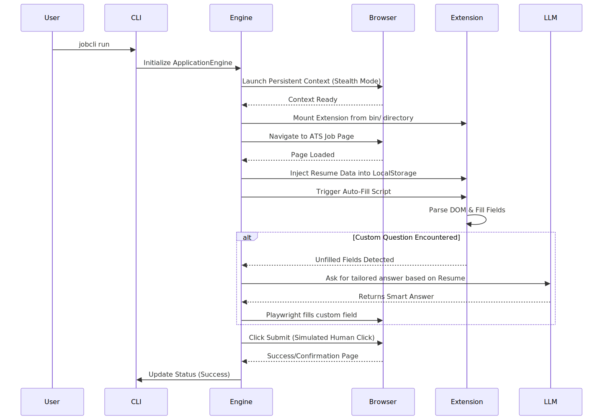

# JobCLI Architecture Overview

JobCLI is a high-fidelity, automated job application engine. It uses a hybrid approach — a natively injected Chrome Extension (TalentScreen) handles DOM autofill, while a Python orchestration layer driven by Playwright and LLMs covers discovery, fallback filling, and session management.

---

## 1. High-Level System Architecture

The system is split into five distinct layers. Each layer has a single responsibility and communicates downward through clean interfaces.



| Layer | Responsibility |
|---|---|
| **CLI Layer** | User-facing commands (`run`, `setup`, `sync`) and interactive onboarding TUI |
| **Orchestration Layer** | Job lifecycle management — discovery, looping, retry, status tracking |
| **Automation & Extension** | Stealth browser launch, Chrome extension mounting, DOM interaction |
| **Intelligence & LLM** | Custom question answering, synonym-based field matching, resume tailoring |
| **Storage & Data** | SQLite persistence, Pydantic-validated resume/profile schemas |

---

## 2. Application Execution Flow

When a user runs `jobcli run`, the system follows this end-to-end sequence:



### Step-by-Step Breakdown

1. **CLI receives `jobcli run`** → instantiates `ApplicationEngine` with the user's config.
2. **Engine launches Chromium** in Stealth mode using Playwright persistent context with anti-detection flags.
3. **Extension is mounted** → `extension/helpers.py` resolves `bin/project-talentscreen-autofill-extension` and passes it via `--load-extension` to Chrome.
4. **Job Discovery** → `wbox_discoverer.py` logs into Whitebox Learning, scrapes job listings from the dashboard.
5. **Per-Job Loop** → For each job URL, the engine navigates, waits for the ATS form to stabilize, then:
   - Injects resume JSON into `localStorage`
   - Triggers the extension's autofill script via a `chrome.runtime.sendMessage` call
   - The extension's content scripts parse each ATS (Workday, Greenhouse, Lever, etc.) using its registered strategy
6. **LLM Fallback** → If any field is left unfilled (custom essay questions, unusual dropdowns), the engine sends the field label + resume context to the configured LLM provider for a tailored answer.
7. **Submit** → A human-simulated click submits the form; the engine records the outcome in SQLite.

---

## 3. Directory Structure

```
wbox-cli/
├── bin/
│   ├── jobcli                          # Unix launcher script
│   ├── jobcli.bat                      # Windows launcher script
│   └── project-talentscreen-autofill-extension/  ← cloned by install.sh
│       ├── manifest.json
│       ├── background.js
│       ├── content.js
│       └── atsStrategies/
├── config/                             # YAML config templates
├── docs/                               # Architecture docs and diagrams
├── scripts/
│   ├── install.sh                      # Clones extension + CLI, sets up env
│   ├── install.ps1                     # Windows equivalent
│   ├── uninstall.sh
│   └── uninstall.ps1
├── src/jobcli/
│   ├── cli/                            # Typer commands + interactive TUI
│   ├── orchestration/                  # ApplicationEngine (engine.py)
│   ├── automation/                     # Stealth Playwright + anti-bot
│   ├── extension/                      # Extension path resolution + verification
│   ├── ats/                            # Per-ATS handlers, locators, schemas
│   ├── intelligence/                   # Synonym resolver, smart field matching
│   ├── llm/                            # OpenAI / Anthropic / Gemini clients
│   ├── profile/                        # Pydantic resume/profile models
│   ├── storage/                        # SQLAlchemy models + repositories
│   ├── human/                          # Human-like mouse/keyboard simulation
│   └── utils/                          # Logging, secure config, helpers
└── tests/
    ├── test_extension_setup.py         # Extension resolution + browser verify
    └── ...                             # Other unit and integration tests
```

---

## 4. Extension Integration Deep Dive

The Chrome Extension is the critical autofill engine. Here's how it integrates:

```
install.sh / install.ps1
    │
    ├── git clone TalentScreen Extension
    │       └── → bin/project-talentscreen-autofill-extension/
    │
    └── git clone wbox-cli
            └── → ~/.jobcli/wbox-cli/

jobcli setup
    │
    └── extension/helpers.py: resolve_extension_dir()
            ├── JOBCLI_EXTENSION_PATH
            ├── config.extension_path
            ├── ~/.jobcli/extension_unpacked  (legacy)
            ├── bin/project-talentscreen-autofill-extension
            └── sibling project-talentscreen-autofill-extension

ApplicationEngine.start_session()
    │
    └── Playwright launch_persistent_context(
              args=["--load-extension=<resolved_path>"]
        )
            └── pageWorldBridge.js → window.AutofillExtension (__bridge)
                    └── autofill_bridge.run_extension_autofill()
```

---

## 5. Key Design Decisions

| Decision | Rationale |
|---|---|
| **Git-cloned extension over CRX download** | Eliminates network brittleness at runtime; extension source is always locally inspectable |
| **Persistent browser context** | Retains cookies/session between job applications — no repeated logins |
| **Stealth Playwright flags** | Bypasses Cloudflare, DataDome, and ATS bot-detection fingerprinting |
| **LLM as fallback only** | Keeps cost low; extension handles 90%+ of standard fields natively |
| **SQLite for state** | Zero-dependency, portable persistence that works offline and on shared machines |
| **Empty `__init__.py` files** | Forces explicit imports, prevents circular dependencies, improves startup time |
